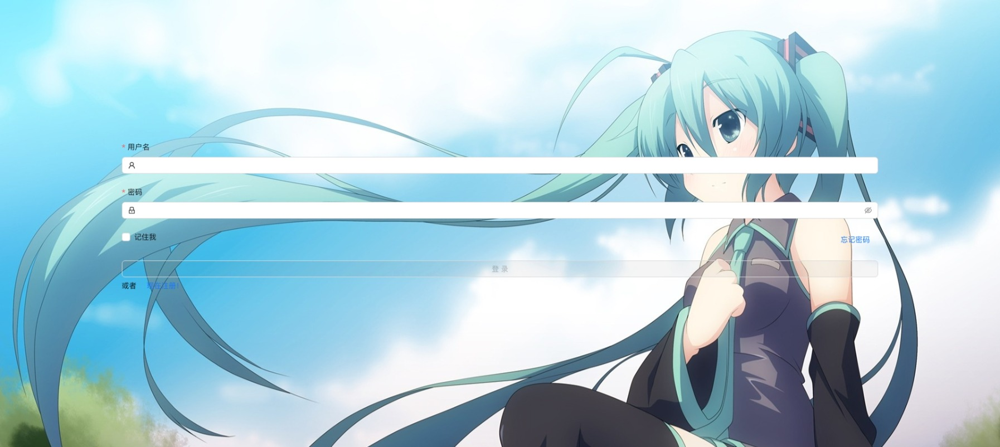
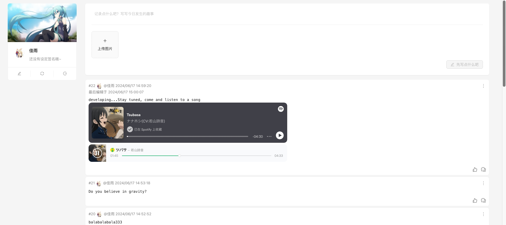
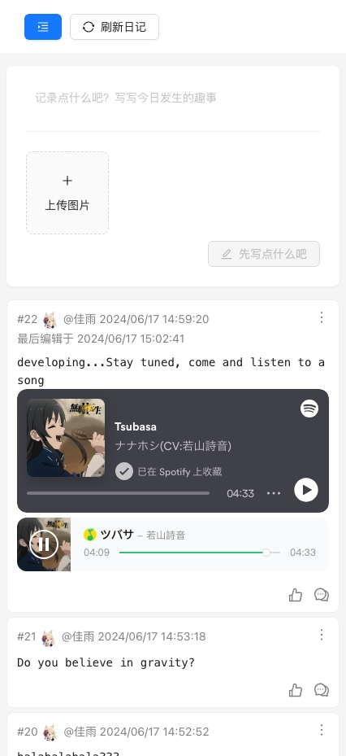
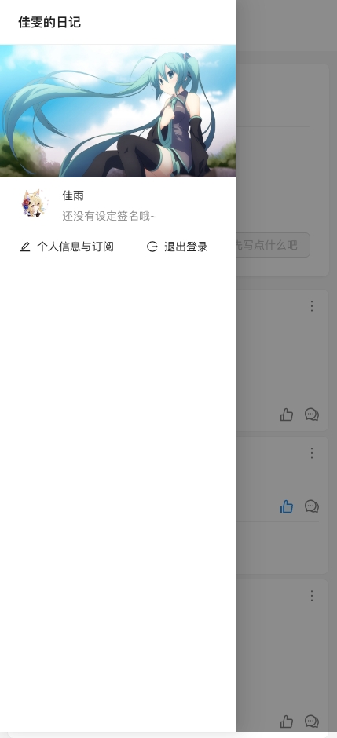
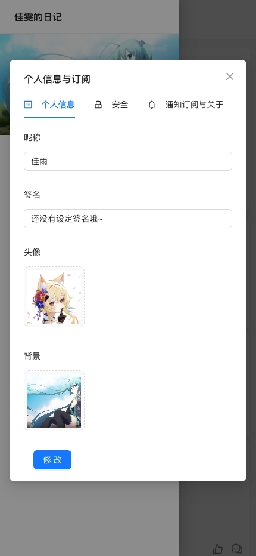

<p align="center">
  <a href="http://nestjs.com/" target="blank"></a>
</p>

## 项目环境与许可


体验地址：<a href="https://diary-dev.amesucre.com" target="_blank">

</a>
|账号|密码|
|:---:|:---:|
|test|test123..|

## 简介

项目的灵感来自memos，简化了一些功能保留基本的日记记录功能
项目采用的前后端分离架构，前端使用vue3+vite+pinia+antdv，后端使用nestjs+typeorm+mysql

<a href="https://gitee.com/SugarZero/diary-jia-wen-notes-service" target="_blank">
    
</a>
<a href="https://github.com/sugar-zero/diary-jia-wen-notes-service" target="_blank">
    
</a>
<a href="https://amedev.amesucre.com/diary/diary-serivce" target="_blank">
    
</a>

带有配套的后台管理系统

> 由于配套的后台管理系统在他人的商用框架基础上进行修改，遵循原作者的要求，不予开源；仅提供构建后程序包
>
> **后台管理系统承诺**
>
> - [x] 不包含非法内容、木马程序等不合规内容与代码
> - [x] 不传输或存储使用者任何数据至第三方
> - [x] 一切数据处理仅在使用者服务器进行
>
> 如不放心可根据后端的admin接口自行编写后台管理系统

<a href="https://amedev.amesucre.com/diary-op/~builds?query=successful+and+~release~" target="_blank">
    
</a><br>

### 实现的功能(仅电脑端样式适配)

- 菜单管理
  - [x] 编辑
- 权限管理
  - [x] 查找
  - [x] 新增
  - [x] 编辑
  - [x] 删除
  - [x] 硬删除
  - [x] 回收站[仅限删除]
- 角色管理
  - [x] 查找
  - [x] 新增
  - [x] 编辑
  - [x] 删除
  - [x] 硬删除
  - [x] 回收站[仅限删除]
- 用户管理
  - [x] 编辑
  - [x] 角色分配
  - [x] 封锁（管理平台拥有豁免权时会忽略该封锁）
  - [x] 解除封锁
- 推送订阅管理
  - [ ] 取消用户订阅
- 系统信息与缓存管理
  - [ ] 编辑系统基本信息
  - [ ] 立刻刷新系统基本信息缓存
- 日记管理
  - [ ] 发布日记（在管理端发布日记有待考虑）
  - [ ] 查找
  - [ ] 编辑
  - [ ] 删除
  - [ ] 硬删除
  - [ ] 回收站[仅限删除]
  - 评论与图片审查
    - [ ] 屏蔽评论
    - [ ] 编辑图片列表

#### 系统基本信息

| 键             | 说明                                                                                                                                                                       |
| -------------- | -------------------------------------------------------------------------------------------------------------------------------------------------------------------------- |
| allowResgister | 允许注册                                                                                                                                                                   |
| filings        | 备案号                                                                                                                                                                     |
| backgroundUrl  | 登录背景图                                                                                                                                                                 |
| version        | 版本号                                                                                                                                                                     |
| diffVersion    | 允许差异的版本（限制ios伪app与网页缓存的时限性，在允许的差异版本内不会要求强制拉取最新的内容可以关闭弹框，超过范围只能操作拉取更新做不了其他操作，一般自己二次开发会用到） |
| maintenance    | 维护模式                                                                                                                                                                   |

### 实现的功能

- [x] 记录、删除日记（带图）
- [x] 点赞、评论
- [x] 修改密码（忘记密码）
- [x] 分页
- [x] ios伪App（添加到主屏幕）
- [x] 推送订阅（已测试web,mac,ios）[具体说明与效果图查看Release1.4.0更新](https://gitee.com/SugarZero/diary-jia-wen-notes/releases/tag/v1.4.0)

### 即将到来的更新

- [ ] 编辑器（Markdown编辑器等）
- [ ] 可配置文件（移除实际运行所需配置项对env的依赖）

## 安装

```bash
$ npm install -g pnpm #if you don't have pnpm
$ pnpm install
```

## 运行

```bash
# 请先配置.env.example文件，修改你的公钥
# 可以在这里生成https://vapidkeys.com/ 或其他方法生成，后端还需要填写密钥
# 请将.env.example文件重命名为.env.development或.env.production
$ pnpm run dev
```

## 构建

```bash
$ pnpm run build
```

## 预览图







#### 管理平台预览


