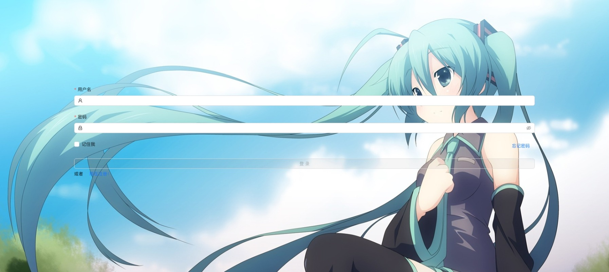
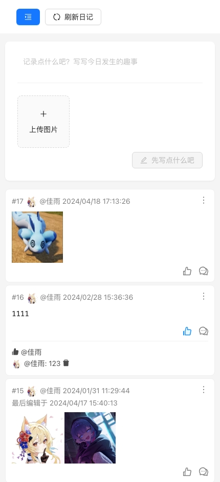
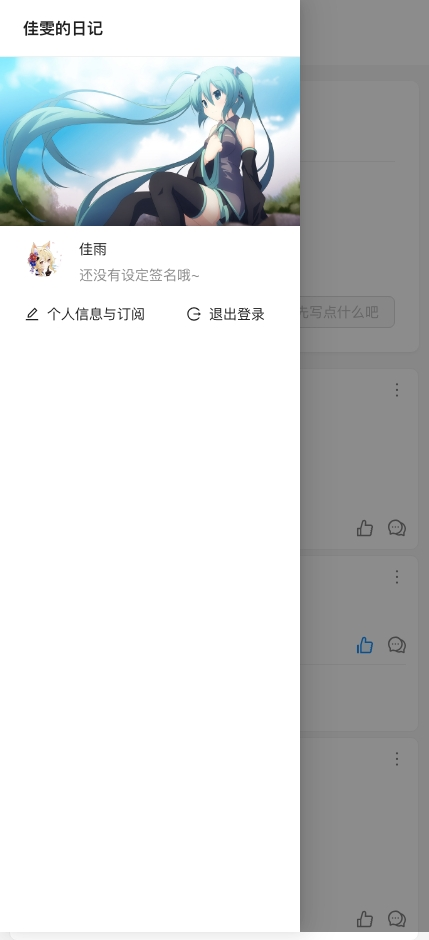
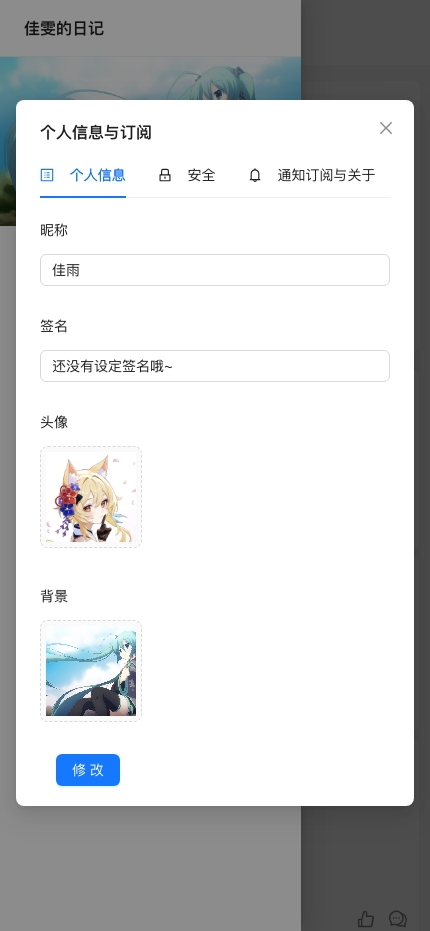

<p align="center">
  <a href="http://nestjs.com/" target="blank"></a>
</p>

## 项目环境与许可


体验地址：<a href="https://diary-dev.amesucre.com" target="_blank">

</a>
|账号|密码|
|:---:|:---:|
|test|test123..|

## 简介

项目的灵感来自memos，简化了一些功能保留基本的日记记录功能
项目采用的前后端分离架构，前端使用vue3+vite+pinia+antdv，后端使用nestjs+typeorm+mysql

<a href="https://gitee.com/SugarZero/diary-jia-wen-notes-service" target="_blank">
    
</a>
<a href="https://github.com/sugar-zero/diary-jia-wen-notes-service" target="_blank">
    
</a>
<a href="https://amedev.amesucre.com/diary/diary-serivce" target="_blank">
    
</a>

带有配套的后台管理系统

> 由于配套的后台管理系统在他人的商用框架基础上进行修改，遵循原作者的要求，不予开源；仅提供构建后程序包
>
> **后台管理系统承诺**
>
> - [x] 不包含非法内容、木马程序等不合规内容与代码
> - [x] 不传输或存储使用者任何数据至第三方
> - [x] 一切数据处理仅在使用者服务器进行
>
> 如不放心可根据后端的admin接口自行编写后台管理系统

<a href="https://amedev.amesucre.com/diary-op/~builds?query=successful+and+~release~" target="_blank">
    
</a><br>
已实现的功能请移步<a href="https://blog.amesucre.com/articles/140" target="_blank">博客</a>查看

### 实现的功能

- [x] 记录、删除日记（带图）
- [x] 点赞、评论
- [x] 修改密码（忘记密码）
- [x] 分页
- [x] ios伪App（添加到主屏幕）
- [x] 推送订阅（已测试web,mac,ios）[具体说明与效果图查看Release1.4.0更新](https://gitee.com/SugarZero/diary-jia-wen-notes/releases/tag/v1.4.0)

### 即将到来的更新

- [ ] 编辑器（Markdown编辑器等）

## 安装

```bash
$ npm install -g pnpm #if you don't have pnpm
$ pnpm install
```

## 运行

```bash
# 请先配置.env.example文件，修改你的公钥
# 可以在这里生成https://vapidkeys.com/ 或其他方法生成，后端还需要填写密钥
# 请将.env.example文件重命名为.env.development或.env.production
$ pnpm run dev
```

## 构建

```bash
$ pnpm run build
```

## 预览图






